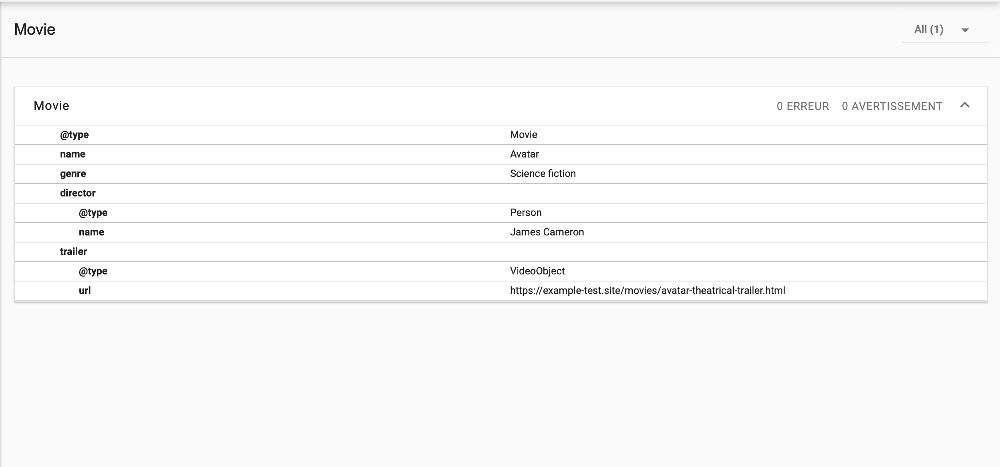
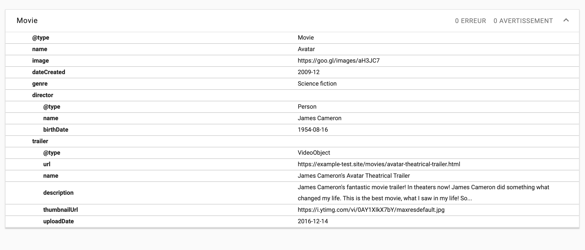

# html-microdata-avatar

> HTML exercise about HTML forms

---

**html-microdata-avatar** is an educational project, which will be used for HTML courses.

**Note:** the school where the course is given, the [HEPL](http://www.provincedeliege.be/hauteecole) from Liège, Belgium, is a french-speaking school. From this point, the instruction will be in french. Sorry.

---

## Les Microdata simples

Complétez le fichier HTML:

1. Complétez le code HTML afin de décrire les informations contenu dans la page, le film Avatar. Commencez par une première version simple sans microdata imbriqués. Le schéma attendu se trouve dans le dossier `assets-starter`;

   

2. Proposez une deuxième version plus complète afin que le réalisateur soit reconnu comme une personne avec sa date de naissance.

   

## Ressources

- [Outil de validation des microdatas de Google](https://search.google.com/test/rich-results?hl=fr)
- [Outil de validation des microdatas de schema.org](https://validator.schema.org/)

## Sources

Getting started with schema.org using Microdata - <http://schema.org/docs/gs.html>
